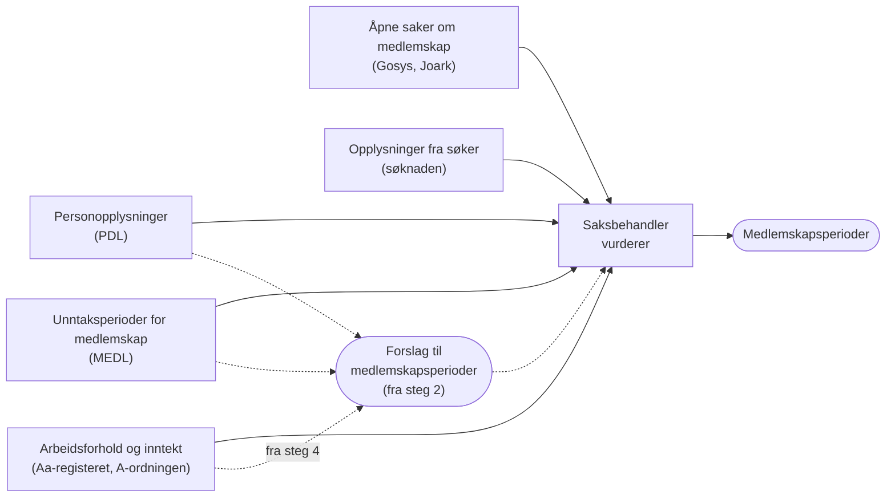
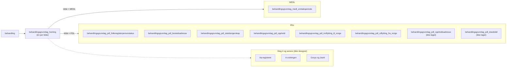

# Behandlingsgrunnlag for medlemskap

Hvilke kilder vi bruker for medlemskapsvilkåret, hvordan vi henter og lagrer
dem etter
[ADR-0007](../../adr/ADR-0007-behandlingsgrunnlag-per-kilde-med-minst-mulig-endring.md),
og hvordan K9, EF og LovMe gjør det.
Hvordan behandlingsgrunnlaget blir til et forslag til medlemskapsperioder, står
i [nasjonalt-medlemskap.md](../../vilkår/nasjonalt-medlemskap.md). Begrepene er
definert i [CONTEXT.md](../../../CONTEXT.md).

Grunnlaget er beskrevet for fag og saksbehandlere i
[confluence/medlemskapsvilkaret.md](../../../confluence/medlemskapsvilkaret.md).
Ingenting av det er i produksjon. Vi bygger i steg, se [Steg](#steg).

## Fra behandlingsgrunnlag til medlemskapsperioder

Medlem i folketrygden er i utgangspunktet den som er bosatt i Norge (ftrl.
§ 2-1). Bosted står i Folkeregisteret, som vi leser fra PDL. Unntakene fra
hovedregelen står i MEDL som unntaksperioder for medlemskap. Den som ikke er
bosatt, kan være medlem som arbeidstaker i Norge (§ 2-2), og det kan vi se i
Aa-registeret og A-ordningen.

Medlemskapsperiodene er ikke behandlingsgrunnlag. De er vurderingen av
vilkåret medlemskap. Saksbehandler fastsetter dem ut fra
behandlingsgrunnlaget. Fra steg 2 lager systemet et forslag til
medlemskapsperioder som saksbehandler godtar eller endrer:

| Kilde | Behandlingsgrunnlag | Tidsrom | Brukes i forslaget fra |
|---|---|---|---|
| PDL | Personstatus, bostedsadresse, statsborgerskap, opphold, inn- og utflytting, land for utenlandsk oppholdsadresse | Hele historikken | Steg 2 |
| PDL (felles for behandlingen) | Dødsfall | Hele historikken | Steg 2 |
| MEDL | Unntaksperioder for medlemskap, alle statuser | Alle perioder | Steg 2 |
| Aa-registeret | Arbeidsforhold | Fra tre måneder før kravet | Steg 4 |
| A-ordningen | Inntekt per måned og arbeidsgiver | Fra tre måneder før kravet | Steg 4 |
| Gosys og Joark | Åpne oppgaver og journalposter med tema `MED`, `UFM` eller `TRY` | Det som er åpent nå | Senere |
| Søknaden | Opplysninger fra søker | – | Brukes ikke. Saksbehandler leser dem. |

Grunnstønad kan gis fra tidligst tre måneder før kravet (§ 22-13 tredje
ledd). Fra PDL og MEDL henter vi likevel alt, slik ADR-0007 legger opp til,
fordi saksbehandler ofte trenger å se hva som skjedde før.

## Steg

| Steg | Systemet | Kilder som må være hentet |
|---|---|---|
| 1 (MVP) | Henter og viser behandlingsgrunnlaget. Saksbehandler vurderer alt. | PDL, MEDL |
| 2 | Foreslår JA i klare tilfeller | PDL, MEDL |
| 3 | Foreslår NEI ut fra MEDL | PDL, MEDL |
| 4 | Foreslår JA etter § 2-2 | Aa-registeret, A-ordningen |
| 5 | Foreslår JA for lovlig opphold ut fra `opphold` | PDL |
| Senere | Regler for åpne saker, Lånekassen og EØS | Gosys, Joark, Lånekassen |

Reglene står i [nasjonalt-medlemskap.md](../../vilkår/nasjonalt-medlemskap.md).

## Kildene i K9, EF, LovMe og hos oss

| Kilde | K9 | EF | LovMe | Hos oss |
|---|---|---|---|---|
| MEDL | Henter `GYLD` og `UAVK`, oversetter dekningskoden | Henter alt, bruker bare `GYLD` | Bruker `GYLD` med lovvalg `ENDL` | Henter alt, lagrer uendret |
| PDL | Personstatus, statsborgerskap, adresser | Personstatus, statsborgerskap, adresser, opphold, inn- og utflytting | Statsborgerskap, bosted, dødsfall | Som EF, pluss land for utenlandsk oppholdsadresse og dødsfall |
| Søknaden | Oppgitt utenlandsopphold | Bosatt og opphold i Norge, utenlandsopphold | Brukersvar om arbeid i utlandet | Leses av saksbehandler |
| Aa-registeret og A-ordningen | Arbeidsforhold og pensjonsgivende inntekt | Ikke for medlemskap | Arbeidsforhold og inntekt | Arbeidsforhold og inntekt for § 2-2 |
| Gosys og Joark | – | – | Åpne oppgaver og journalposter om medlemskap | Som LovMe |
| UDI | – | – | Oppholdstillatelse og arbeidsadgang | Kanskje senere |
| Lagres som | Egne tabeller per aggregat, oversatt og periodisert | Ett JSON-dokument per behandling | – | Én tabell per opplysningstype, uendret |

## Henting

Prinsippene står i ADR-0007, som er foreslått, men ikke godkjent. For
medlemskap betyr det:

- Behandlingsgrunnlaget hentes automatisk i samme transaksjon som
  behandlingen opprettes. Svarer ikke kilden, for eksempel PDL, feiler
  REST-kallet som oppretter behandlingen, og saksbehandler må prøve på nytt.
  Da har alle nye behandlinger grunnlag fra kildene.
- Saksbehandler kan hente på nytt så lenge behandlingen kan redigeres. En ny
  henting erstatter det som er lagret fra samme kilde for denne behandlingen.
  Behandlingsgrunnlaget i andre behandlinger endres ikke.
- Er grunnlaget hentet på nytt etter at medlemskap er vurdert, viser vi
  saksbehandler at grunnlaget er endret. Vurderingen beholdes.
- Én felles tabell har én rad per behandling og kilde, med tidspunktet for
  hentingen. Da kan vi vise «Hentet 12.03, ingen unntaksperioder for medlemskap» og skille det
  fra «ikke hentet». For PDL kunne vi lest det ut fra grunnlagsradene, men et
  tomt svar fra MEDL gir ingen rader.
- Opplysningene lagres slik kilden leverte dem, i én tabell per
  opplysningstype, med kolonner og ikke JSONB.

## Lagring hos oss

Et forslag til tabeller etter ADR-0007. Tabellnavnene har prefikset
`behandlingsgrunnlag_`. Feltnavnene er fra kilden, i snake_case.
Tekstkolonner er `text`. Alle tabellene har `behandling_id`, og en ny henting
sletter radene fra samme kilde for behandlingen og setter inn nye.

Tabellene for PDL er laget (`V37__behandlingsgrunnlag_pdl.sql`), bortsett fra
oppholdsadresse og dødsfall. Resten er forslag.

### Hentingen

`behandlingsgrunnlag_henting` har én rad per behandling og kilde:
`behandling_id`, `kilde` (`MEDL` eller `PDL`) og `hentet_tidspunkt`, med
unik-krav på `(behandling_id, kilde)`. Finnes raden, men ingen
unntaksperioder, svarte MEDL uten treff.

### Unntaksperioder fra MEDL

`behandlingsgrunnlag_medl_unntaksperiode` har én rad per unntaksperiode slik MEDL leverer den
(`MedlemskapsunntakForGet` i `navikt/medlemskap-medl`), med unik-krav på
`(behandling_id, unntak_id)`:

| Kolonne | Fra MEDL | Merknad |
|---|---|---|
| `unntak_id` | `unntakId` | Stabil mellom oppslag |
| `fra_og_med`, `til_og_med` | `fraOgMed`, `tilOgMed` | Påkrevd i API-et, men K9 håndterer åpne perioder |
| `status`, `statusaarsak` | `status`, `statusaarsak` | Kodeverk `PeriodestatusMedl`, `StatusaarsakMedl` |
| `medlem` | `medlem` | |
| `dekning` | `dekning` | Kodeverk `DekningMedl`, kan mangle |
| `helsedel` | `helsedel` | |
| `grunnlag` | `grunnlag` | Kodeverk `GrunnlagMedl` |
| `lovvalg`, `lovvalgsland` | `lovvalg`, `lovvalgsland` | Kodeverk `LovvalgMedl`, `Landkoder` |
| `sporingsinformasjon_*` | Hele `sporingsinformasjon`, flatet ut | `versjon`, `registrert`, `besluttet`, `kilde`, `kildedokument`, `opprettet`, `opprettet_av`, `sist_endret`, `sist_endret_av` |

Vi lagrer alle statuser, også avviste perioder, og forslaget til
medlemskapsperioder velger hva som teller. `studieinformasjon` (fra
Lånekassen) lagrer vi ikke nå. Perioder med `sporingsinformasjon_kilde`
Lånekassen vurderes manuelt, og Lånekassen kan bli en egen kilde senere.

### Personopplysninger fra PDL

Én tabell per opplysningstype, med hele historikken (`historikk: true`). Alle
tabellene har de samme metadatakolonnene, fordi periodene for noen typer bare
står i metadata:

| Kolonne | Fra PDL |
|---|---|
| `historisk` | `metadata.historisk` |
| `master` | `metadata.master` |
| `gyldighetstidspunkt` | `folkeregistermetadata.gyldighetstidspunkt` |
| `opphoerstidspunkt` | `folkeregistermetadata.opphoerstidspunkt` |

Vi lagrer ikke endringsloggen (`metadata.endringer`).

| Tabell | Kolonner i tillegg til metadata |
|---|---|
| `behandlingsgrunnlag_pdl_folkeregisterpersonstatus` | `status`, `forenklet_status` |
| `behandlingsgrunnlag_pdl_bostedsadresse` | `adressetype` (`VEGADRESSE`, `MATRIKKELADRESSE`, `UTENLANDSK_ADRESSE` eller `UKJENT_BOSTED`), `kommunenummer`, `bostedskommune`, `landkode`, `gyldig_fra_og_med`, `gyldig_til_og_med`, `angitt_flyttedato`. Ikke resten av adressen. |
| `behandlingsgrunnlag_pdl_statsborgerskap` | `land`, `gyldig_fra_og_med`, `gyldig_til_og_med`, `bekreftelsesdato` |
| `behandlingsgrunnlag_pdl_opphold` | `type`, `opphold_fra`, `opphold_til` |
| `behandlingsgrunnlag_pdl_innflytting_til_norge` | `fraflyttingsland`, `fraflyttingssted_i_utlandet` |
| `behandlingsgrunnlag_pdl_utflytting_fra_norge` | `tilflyttingsland`, `tilflyttingssted_i_utlandet`, `utflyttingsdato` |
| `behandlingsgrunnlag_pdl_oppholdsadresse` (ikke laget) | `landkode`, `gyldig_fra_og_med`, `gyldig_til_og_med`. Bare utenlandske oppholdsadresser. |
| `behandlingsgrunnlag_pdl_doedsfall` (ikke laget) | `doedsdato`. Felles for hele behandlingen, ikke bare medlemskap. |

### Aa-registeret, A-ordningen, Gosys og Joark

Tabellene er ikke designet. De skal følge ADR-0007 og ha med:

| Kilde | Opplysninger |
|---|---|
| Aa-registeret | Arbeidsforhold med arbeidsgiver, type (ordinært, maritimt, frilanser), ansettelsesperiode og utenlandsopphold, fra tre måneder før kravet |
| A-ordningen | Pensjonsgivende inntekt per måned og arbeidsgiver, fra tre måneder før kravet |
| Gosys og Joark | Åpne oppgaver og journalposter med tema `MED`, `UFM` eller `TRY` |

## MEDL

MEDL (medlemskapsregisteret, `medlemskap-medl-api` i team-rocket) registrerer
unntak fra hovedregelen om medlemskap etter bosted. Vanlig medlemskap for folk
som bor og jobber i Norge, er normalt ikke registrert. MEDL kaller en
unntaksperiode for medlemskap for «medlemskapsunntak» i API-et og «medlemskapsperiode» i
Dolly.

### Hva en unntaksperiode for medlemskap sier

- `medlem` sier om søker er medlem av folketrygden i perioden. En
  unntaksperiode for medlemskap kan ha både `medlem = true` (for eksempel frivillig medlemskap
  eller arbeid i utlandet for norsk arbeidsgiver) og `medlem = false` (for
  eksempel unntatt etter en trygdeavtale).
- `status` sier om registreringen gjelder (for eksempel gyldig, avvist eller
  uavklart). Den sier ikke om søker er medlem.
- `dekning`, `grunnlag`, `lovvalg` og `lovvalgsland` er koder fra kodeverk
  (`DekningMedl`, `GrunnlagMedl`, `LovvalgMedl`, `Landkoder`). Vi lagrer
  kodene som de er.
- `dekning` er trygdedekningen: hvilke kapitler i folketrygdloven perioden
  gir rett til ytelser etter. Bare noen koder dekker kap. 6. Se
  [Trygdedekning for kap. 6](../../vilkår/nasjonalt-medlemskap.md#trygdedekning-for-kap-6).
- `lovvalg` sier om lovvalget er endelig (`ENDL`), foreløpig (`FORL`) eller
  under avklaring (`UAVK`). Bare perioder med status `GYLD` og lovvalg `ENDL`
  avgjør vilkåret, slik LovMe gjør. Avviste perioder (`AVST`) vises bare.
- `unntakId` er id-en MEDL bruker for perioden, og den er den samme fra oppslag
  til oppslag.

**Et tomt svar fra MEDL betyr ikke «ikke medlem».** Det betyr at det ikke er
registrert noen unntaksperioder for medlemskap, og da avgjør bosted i PDL.

### Testdata i Dolly

MEDL validerer kombinasjonen av grunnlag, dekning, land og periode. Dekningen
`FTL_2-9_2_ld_jfr_1a` er for eksempel ikke gyldig for Australia. Denne
kombinasjonen fungerer i dev:

| Felt | Verdi |
|---|---|
| Kilde | Melosys |
| Periode | 01.09.2010–31.08.2020 |
| Grunnlag | Avtale – Australia |
| Dekning | Unntatt |
| Lovvalg | Endelig |
| Lovvalgsland | Australia |
| Status | Gyldig |
| Helsedel | Nei |
| Medlem | Nei |

## PDL

Spørringen vi bruker, er
[`hent_behandlingsgrunnlag.graphql`](../../../apps/sak/src/main/resources/pdl/hent_behandlingsgrunnlag.graphql).
Den kjøres når behandlingen opprettes, og når saksbehandler henter på nytt.

### Hva vi henter, og hvorfor

Medlem i folketrygden er i utgangspunktet den som er bosatt i Norge (ftrl.
§ 2-1). Vi henter derfor det Folkeregisteret sier om bosted, og det som
avgjør hvilke regler som gjelder for den som bor her:

| Opplysning | Felt vi henter | Hvorfor |
|---|---|---|
| `folkeregisterpersonstatus` | `status`, `forenkletStatus` | Om søker er bosatt, utflyttet eller død. Død avslutter tidslinjen. |
| `bostedsadresse` | Adressetype, `kommunenummer`, `bostedskommune`, `landkode`, `gyldigFraOgMed`, `gyldigTilOgMed`, `angittFlyttedato` | Om søker bor i Norge, i utlandet eller har ukjent bosted, og når. Utenlandsk adresse gir manuell vurdering. |
| `statsborgerskap` | `land`, `gyldigFraOgMed`, `gyldigTilOgMed`, `bekreftelsesdato` | Om søker er nordisk statsborger, EØS-borger eller tredjelandsborger. Det avgjør hvilke regler som gjelder. |
| `opphold` | `type`, `oppholdFra`, `oppholdTil` | Oppholdstillatelse fra UDI. Grunnlag for å vurdere lovlig opphold (§ 2-1 tredje ledd), automatisk fra steg 5. |
| `innflyttingTilNorge` | `fraflyttingsland`, `fraflyttingsstedIUtlandet` | Viser saksbehandler når og hvorfra søker flyttet til Norge. |
| `utflyttingFraNorge` | `tilflyttingsland`, `tilflyttingsstedIUtlandet`, `utflyttingsdato` | Viser saksbehandler når og hvor søker flyttet fra Norge. |
| `oppholdsadresse` | `utenlandskAdresse.landkode`, `gyldigFraOgMed`, `gyldigTilOgMed`. Bare utenlandske adresser. | Kan vise at søker har vært borte i mer enn 12 måneder selv om hen er registrert som bosatt. Vises bare, brukes ikke i reglene. |
| `doedsfall` | `doedsdato` | Avslutter tidslinjen. Felles grunnlag for hele behandlingen. |

Spørringen henter ennå ikke `oppholdsadresse` og `doedsfall`.

For alle opplysningene henter vi også `metadata.historisk` og
`metadata.master`, og `gyldighetstidspunkt` og `opphoerstidspunkt` fra
`folkeregistermetadata`. For noen opplysninger står perioden bare der.

Vi henter med historikk (`historikk: true`). Medlemskapsperiodene dekker hele
tidslinjen, så vi trenger å vite hvor søker bodde og hvilket statsborgerskap
søker hadde tidligere, ikke bare i dag. `innflyttingTilNorge` og
`utflyttingFraNorge` har ikke valget og gir alltid alle.

### Hva vi ikke henter

ADR-0007 sier at vi bare lagrer det vilkårene trenger. Derfor henter vi ikke:

| Opplysning | Hvorfor ikke |
|---|---|
| Resten av bostedsadressen, som gate, husnummer og postnummer | Vilkåret trenger bare å vite om adressen er norsk, utenlandsk eller ukjent, og kommunen eller landet |
| Resten av oppholdsadressen, og norske oppholdsadresser | Bare landet for utenlandske adresser er interessant |
| `kontaktadresse` | Det er en postadresse og sier lite om hvor søker bor |
| `deltBosted` | Gjelder barn |
| `folkeregisteridentifikator` | Personstatus viser allerede om søker har fødselsnummer eller D-nummer |
| `foedested` | Vi har ikke krav om forutgående medlemskap |
| `sivilstand` og `forelderBarnRelasjon` | Medlemskap som følger av familien (§§ 2-5, 2-7 og 2-8), står i MEDL |
| `utenlandskIdentifikasjonsnummer` | Svakt signal. Vurderes på nytt når EØS kommer. |
| Endringsloggen (`metadata.endringer`) | Vi trenger bare perioden |

PDL-skjemaet i `apps/sak/src/main/resources/pdl/pdl-api-schema.graphql` viser
alle feltene vi kan hente.

## Slik gjør K9

Kildene er k9-sak, `behandlingslager/.../medlemskap` og
`behandlingslager/.../personopplysning`, og
[nasjonalt-medlemskap.md](../../vilkår/nasjonalt-medlemskap.md) beskriver
vurderingen.

**Henter:**

| Grunnlag | Kilde | Hva K9 tar med |
|---|---|---|
| Medlemskapsperioder (våre unntaksperioder for medlemskap) | MEDL | Bare status `GYLD` og `UAVK` (`MedlemsunntakRestKlient` i k9-felles) |
| Personopplysninger | PDL | Personstatus, statsborgerskap og adresser, med perioder |
| Oppgitt tilknytning | Søknaden | Utenlandsopphold med land og periode |
| Arbeidsforhold og pensjonsgivende inntekt | Aa-registeret og A-ordningen | Arbeid i Norge for ikke-bosatte (§ 2-2) og oppholdsrett for EØS-borgere |

**Lagrer:** Hvert register er et eget aggregat i egne tabeller, og
`GR_MEDLEMSKAP` (`MedlemskapBehandlingsgrunnlagEntitet`) peker på versjonene som
gjelder for behandlingen:

| Tabell | Innhold |
|---|---|
| `MEDLEMSKAP_REGISTRERT` og `MEDLEMSKAP_PERIODER` (`MedlemskapPerioderEntitet`) | Periode, `beslutningsdato`, `er_medlem`, `lovvalg_land`, `studie_land`, `medl_id`, og `dekning_type`, `medlemskap_type` og `kilde_type` oversatt til K9 sitt kodeverk |
| `MEDLEMSKAP_OPPG_TILKNYT` og `MEDLEMSKAP_OPPG_LAND` | Oppgitt tilknytning fra søknaden |
| `PO_PERSONSTATUS`, `PO_STATSBORGERSKAP`, `PO_ADRESSE` | Personopplysninger fra PDL, med perioder |

Aggregatene deles mellom behandlinger. En ny behandling peker på de samme
aggregatene til en ny henting gir en ny versjon.

**Lager:** Saksbehandlers avklaringer per vurderingsdato
(`MEDLEMSKAP_VURDERING_PERIODE` og `MEDLEMSKAP_VURDERING_LOPENDE`) og et
vilkårsresultat per periode for medlemskapsvilkåret.

Slik skiller vi oss fra K9:

- K9 oversetter MEDL-kodene før lagring. Vi lagrer opplysningene
  uendret og tolker dem når de brukes.
- K9 henter bare noen statuser fra MEDL. Vi henter alle.
- K9 samler kildene for medlemskap i `GR_MEDLEMSKAP`. Vi har ett
  behandlingsgrunnlag per kilde.
- K9 lagrer avklaringer per vurderingsdato. Vi lagrer
  medlemskapsperioder.

## Slik gjør EF

familie-ef-sak har ikke ett medlemskapsvilkår, men to:
**forutgående medlemskap** (`ForutgåendeMedlemskapRegel`, medlem de siste
fem årene) og **opphold i Norge** (`OppholdINorgeRegel`, vilkårtypen
`LOVLIG_OPPHOLD`). Grunnstønad har ikke krav om forutgående medlemskap, så det
er opphold i Norge som ligner mest på vårt vilkår.

**Henter:**

| Grunnlag | Kilde | Hva EF tar med |
|---|---|---|
| Personopplysninger | PDL | Statsborgerskap med historikk, oppholdstillatelse, bostedsadresser, inn- og utflytting og personstatus |
| Unntaksperioder for medlemskap | MEDL, via familie-integrasjoner | Alle perioder, gruppert som gyldige, avviste og uavklarte (`Medlemskapsinfo` i familie-kontrakter). Hver periode har fra, til, status, statusårsak, `gjelderMedlemskapIFolketrygden`, grunnlag og dekning. |
| Opplysninger om medlemskap | Søknaden | Bosatt i Norge de siste årene, oppholder seg i Norge, oppholdsland og utenlandsopphold med land, periode og årsak |

**Lagrer:** Hele behandlingsgrunnlaget lagres som ett JSON-dokument per
behandling (`Grunnlagsdata` med `GrunnlagsdataDomene`, der MEDL ligger i
`medlUnntak`). Nye data fra registrene lagres ved siden av (`oppdaterteData`),
slik at saksbehandler kan se hva som er endret før hen tar dem i bruk. Filen
har en advarsel om at endringer må godkjennes av to, fordi JSON-en er lagret i
databasen.

**Lager:** En vilkårsvurdering for hele behandlingen per vilkår, med svar på
faste spørsmål (`MedlemskapMapper` og `MedlemskapDto` viser grunnlaget).

- Systemet vurderer bare de klare tilfellene, og bare som «ja»:
  - Opphold i Norge: digital søknad, norsk statsborger, bosatt, søker svarer
    at hen bor og oppholder seg i Norge, og barna er bosatt.
  - Forutgående medlemskap: født i Norge, norsk statsborger, bosatt, ingen
    inn- eller utflytting de siste fem årene, og søknaden sier det samme.
- MEDL brukes ikke i den automatiske vurderingen. Bare de gyldige
  unntaksperiodene vises for saksbehandler.
- Alt annet vurderer saksbehandler med faste svaralternativer, for eksempel
  «arbeid for norsk arbeidsgiver» eller «utenlandsopphold under seks uker».

Slik skiller vi oss fra EF:

- EF lagrer alle kildene samlet som JSON. Vi har ett behandlingsgrunnlag
  per kilde, i kolonner.
- EF viser bare de gyldige unntaksperiodene. Vi lagrer og viser alle.
- EF vurderer for hele behandlingen. Vi lagrer medlemskapsperioder.

Forslaget til medlemskapsperioder ligner på EF: systemet foreslår bare det som er
klart, og resten vurderes av saksbehandler.

## Slik gjør LovMe

LovMe (`navikt/medlemskap-oppslag`) vurderer medlemskap for sykepenger. Vi
bruker LovMe som utgangspunkt for hvordan vi leser MEDL og Gosys/Joark, men
sykepenger har andre krav og unntak enn grunnstønad.

**Henter:** MEDL, PDL, Aa-registeret, A-ordningen (inntekt), UDI
(oppholdstillatelse og arbeidsadgang), åpne oppgaver i Gosys og journalposter
i Joark med tema `MED`, `UFM` eller `TRY`, og brukersvar fra søknaden.

**Vurderer:**

- Bare MEDL-perioder med status `GYLD` og lovvalg `ENDL` teller. Andre
  statuser og lovvalg gir uavklart.
- Perioder med og uten medlemskap i samme kontrollperiode gir uavklart.
- Trygdedekningen tolkes per ytelse (`Dekning` i `Medlemskap.kt`).
- Første NEI vinner. Ellers vinner JA fra MEDL over reglene for bosted og
  arbeid.
- Reglene for arbeid krever 12 måneders kontrollperiode med uendret
  arbeidsforhold. Det er et krav for sykepenger, ikke for oss.

Slik skiller vi oss fra LovMe:

- Vi lagrer behandlingsgrunnlaget uendret per kilde. LovMe er en
  regeltjeneste.
- Vi bruker egen tabell over trygdedekning for kap. 6.
- Vi har ikke krav om forutgående medlemskap eller arbeid i en kontrollperiode.

## Medlemskapsperioder

Medlemskapsperiodene er vurderingen av vilkåret medlemskap (`VilkårMedlemskap`
i koden), og de dekker hele tidslinjen fra tidligste mulige virkningstidspunkt.
Hver periode sier om søker er medlem etter nasjonale regler eller EØS-reglene.
Foreløpig har vi bare nasjonale regler.

Fra steg 2 lager systemet et forslag til medlemskapsperioder fra
behandlingsgrunnlaget. Perioder systemet ikke kan avgjøre, får ingen
vurdering, men en grunn til at saksbehandler må vurdere dem. Forslaget lagres
ikke. Det er beskrevet i
[nasjonalt-medlemskap.md](../../vilkår/nasjonalt-medlemskap.md). I steg 1
vurderer saksbehandler alle periodene selv. Se [Steg](#steg).

## Åpne spørsmål

- Hvordan skal tabellene for Aa-registeret, A-ordningen, Gosys og Joark se ut?
- Skal vi hente fra Lånekassen, og lagre `studieinformasjon` fra MEDL, når vi
  lager regler for studenter i utlandet?
- Skal vi hente arbeidsadgang direkte fra UDI for tredjelandsborgere?
- Vil saksbehandler se hele bostedsadressen? Da må vi lagre mer enn type,
  kommune og land.
- `sporingsinformasjon` har `opprettetAv` og `sistEndretAv`. Trenger vi dem,
  eller holder det med tidspunktene?
- Spør søknaden om utenlandsopphold?
