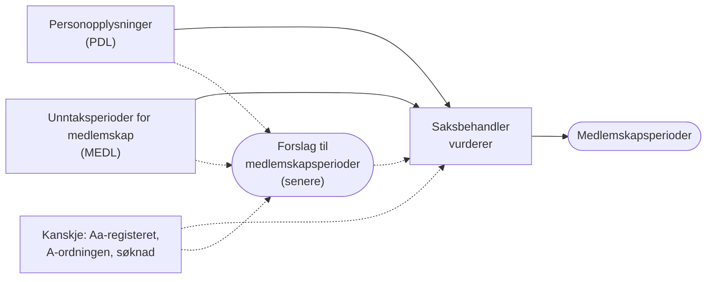
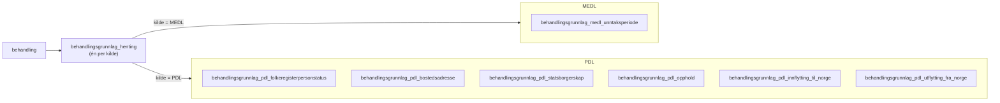

# Behandlingsgrunnlag for medlemskap

Hvilke kilder K9 og EF bruker for medlemskap, hva de henter, hva de lager av
det, og hvordan vi kan hente og lagre det samme etter
[ADR-0007](../../adr/ADR-0007-behandlingsgrunnlag-per-kilde-med-minst-mulig-endring.md).
Hvordan behandlingsgrunnlaget blir til et forslag til medlemskapsperioder, står
i [nasjonalt-medlemskap.md](../../vilkår/nasjonalt-medlemskap.md). Begrepene er
definert i [CONTEXT.md](../../../CONTEXT.md).

Dette er en plan, ikke en beslutning. Ingenting av det er i produksjon, og
både kildene og ambisjonsnivået kan endre seg. Se
[Ambisjonsnivå](#ambisjonsnivå).

## Fra behandlingsgrunnlag til medlemskapsperioder

Medlem i folketrygden er i utgangspunktet den som er bosatt i Norge (ftrl.
§ 2-1). Bosted står i Folkeregisteret, som vi leser fra PDL. Unntakene fra
hovedregelen står i MEDL som unntaksperioder for medlemskap.

Medlemskapsperiodene er ikke behandlingsgrunnlag. De er vurderingen av
vilkåret medlemskap. Saksbehandler fastsetter dem ut fra
behandlingsgrunnlaget. Etter hvert kan systemet lage et forslag til
medlemskapsperioder som saksbehandler godtar eller endrer:

| Kilde | Behandlingsgrunnlag |
|---|---|
| PDL | Personstatus, bostedsadresse, statsborgerskap, opphold, inn- og utflytting |
| MEDL | Unntaksperioder for medlemskap |
| Aa-registeret og A-ordningen (kanskje) | Arbeidsforhold og pensjonsgivende inntekt |
| Søknaden (kanskje) | Utenlandsopphold |

## Ambisjonsnivå

Vi har ikke bestemt hvor mye første runde skal gjøre. To nivåer er aktuelle:

1. **Hente og vise.** Systemet henter behandlingsgrunnlaget og viser det, og
   saksbehandler vurderer alle medlemskapsperiodene selv. Det er det laveste
   ambisjonsnivået, og vi kan starte med det.
2. **Foreslå.** Systemet lager i tillegg et forslag til medlemskapsperioder,
   som beskrevet i [nasjonalt-medlemskap.md](../../vilkår/nasjonalt-medlemskap.md).

Hvilke kilder vi trenger, avhenger av nivået:

- PDL og MEDL trengs på begge nivåer.
- **Aa-registeret og A-ordningen** må vi kanskje hente før vi lager forslag.
  Arbeid i Norge kan gi medlemskap for en som ikke er bosatt (ftrl. § 2-2), og
  K9 bruker det også for å vurdere oppholdsrett for EØS-borgere. Uten dem blir
  alle som ikke er bosatt, vurdert manuelt, og da gir forslaget kanskje for
  lite til å være verdt det. Det må vi se nærmere på.
- **Utenlandsopphold fra søknaden.** K9 og EF bruker det søker oppgir om
  opphold i utlandet. Vi vet ikke om søknaden om grunnstønad spør om dette.

## Kildene i K9, EF og planen vår

| Kilde | K9 | EF | Plan for oss |
|---|---|---|---|
| MEDL | Henter `GYLD` og `UAVK`, oversetter dekningskoden | Henter alt, bruker bare `GYLD` | Hente alt, lagre uendret |
| PDL | Personstatus, statsborgerskap, adresser | Personstatus, statsborgerskap, adresser, opphold, inn- og utflytting | Som EF |
| Søknaden | Oppgitt utenlandsopphold | Bosatt og opphold i Norge, utenlandsopphold | Uavklart |
| Aa-registeret og A-ordningen | Arbeidsforhold og pensjonsgivende inntekt | Ikke for medlemskap | Kanskje før forslag |
| Lagres som | Egne tabeller per aggregat, oversatt og periodisert | Ett JSON-dokument per behandling | Én tabell per opplysningstype, uendret |

## Henting

Prinsippene står i ADR-0007, som er foreslått, men ikke godkjent. For
medlemskap vil det bety:

- Behandlingsgrunnlaget hentes automatisk når behandlingen opprettes. Svarer
  ikke kilden, opprettes behandlingen likevel, og frontend viser «ikke
  hentet».
- Saksbehandler kan hente på nytt så lenge behandlingen kan redigeres. En ny
  henting erstatter det som er lagret fra samme kilde for denne behandlingen.
  Behandlingsgrunnlaget i andre behandlinger endres ikke.
- Er grunnlaget hentet på nytt etter at medlemskap er vurdert, viser vi
  saksbehandler at grunnlaget er endret. Vurderingen beholdes.
- Én felles tabell har én rad per behandling og kilde, med tidspunktet for
  hentingen. Da kan vi vise «Hentet 12.03, ingen unntaksperioder for medlemskap» og skille det
  fra «ikke hentet». For PDL kunne vi lest det ut fra grunnlagsradene, men et
  tomt svar fra MEDL gir ingen rader.
- Opplysningene lagres slik kilden leverte dem, i én tabell per
  opplysningstype, med kolonner og ikke JSONB.

## Lagring hos oss

Et forslag til tabeller etter ADR-0007. Tabellnavnene har prefikset
`behandlingsgrunnlag_`. Feltnavnene er fra kilden, i snake_case.
Tekstkolonner er `text`. Alle tabellene har `behandling_id`, og en ny henting
sletter radene fra samme kilde for behandlingen og setter inn nye.

### Hentingen

`behandlingsgrunnlag_henting` har én rad per behandling og kilde:
`behandling_id`, `kilde` (`MEDL` eller `PDL`) og `hentet_tidspunkt`, med
unik-krav på `(behandling_id, kilde)`. Finnes raden, men ingen
unntaksperioder, svarte MEDL uten treff.

### Unntaksperioder fra MEDL

`behandlingsgrunnlag_medl_unntaksperiode` har én rad per unntaksperiode slik MEDL leverer den
(`MedlemskapsunntakForGet` i `navikt/medlemskap-medl`), med unik-krav på
`(behandling_id, unntak_id)`:

| Kolonne | Fra MEDL | Merknad |
|---|---|---|
| `unntak_id` | `unntakId` | Stabil mellom oppslag |
| `fra_og_med`, `til_og_med` | `fraOgMed`, `tilOgMed` | Påkrevd i API-et, men K9 håndterer åpne perioder |
| `status`, `statusaarsak` | `status`, `statusaarsak` | Kodeverk `PeriodestatusMedl`, `StatusaarsakMedl` |
| `medlem` | `medlem` | |
| `dekning` | `dekning` | Kodeverk `DekningMedl`, kan mangle |
| `helsedel` | `helsedel` | |
| `grunnlag` | `grunnlag` | Kodeverk `GrunnlagMedl` |
| `lovvalg`, `lovvalgsland` | `lovvalg`, `lovvalgsland` | Kodeverk `LovvalgMedl`, `Landkoder` |
| `sporingsinformasjon_*` | Hele `sporingsinformasjon`, flatet ut | `versjon`, `registrert`, `besluttet`, `kilde`, `kildedokument`, `opprettet`, `opprettet_av`, `sist_endret`, `sist_endret_av` |

Planen er å lagre alle statuser, også avviste perioder, og la et eventuelt
forslag velge hva som teller. Om vi skal lagre `studieinformasjon` (fra
Lånekassen), er ikke avklart. Se åpne spørsmål.

### Personopplysninger fra PDL

Én tabell per opplysningstype, med hele historikken (`historikk: true`). Alle
tabellene har de samme metadatakolonnene, fordi periodene for noen typer bare
står i metadata:

| Kolonne | Fra PDL |
|---|---|
| `historisk` | `metadata.historisk` |
| `master` | `metadata.master` |
| `gyldighetstidspunkt` | `folkeregistermetadata.gyldighetstidspunkt` |
| `opphoerstidspunkt` | `folkeregistermetadata.opphoerstidspunkt` |

Planen er ikke å lagre endringsloggen (`metadata.endringer`).

| Tabell | Kolonner i tillegg til metadata |
|---|---|
| `behandlingsgrunnlag_pdl_folkeregisterpersonstatus` | `status`, `forenklet_status` |
| `behandlingsgrunnlag_pdl_bostedsadresse` | `gyldig_fra_og_med`, `gyldig_til_og_med`, `angitt_flyttedato`, adressetype og land. Se åpne spørsmål. |
| `behandlingsgrunnlag_pdl_statsborgerskap` | `land`, `gyldig_fra_og_med`, `gyldig_til_og_med`, `bekreftelsesdato` |
| `behandlingsgrunnlag_pdl_opphold` | `type`, `opphold_fra`, `opphold_til` |
| `behandlingsgrunnlag_pdl_innflytting_til_norge` | `fraflyttingsland`, `fraflyttingssted_i_utlandet` |
| `behandlingsgrunnlag_pdl_utflytting_fra_norge` | `tilflyttingsland`, `tilflyttingssted_i_utlandet`, `utflyttingsdato` |

## MEDL

MEDL (medlemskapsregisteret, `medlemskap-medl-api` i team-rocket) registrerer
unntak fra hovedregelen om medlemskap etter bosted. Vanlig medlemskap for folk
som bor og jobber i Norge, er normalt ikke registrert. MEDL kaller en
unntaksperiode for medlemskap for «medlemskapsunntak» i API-et og «medlemskapsperiode» i
Dolly.

### Hva en unntaksperiode for medlemskap sier

- `medlem` sier om søker er medlem av folketrygden i perioden. En
  unntaksperiode for medlemskap kan ha både `medlem = true` (for eksempel frivillig medlemskap
  eller arbeid i utlandet for norsk arbeidsgiver) og `medlem = false` (for
  eksempel unntatt etter en trygdeavtale).
- `status` sier om registreringen gjelder (for eksempel gyldig, avvist eller
  uavklart). Den sier ikke om søker er medlem.
- `dekning`, `grunnlag`, `lovvalg` og `lovvalgsland` er koder fra kodeverk
  (`DekningMedl`, `GrunnlagMedl`, `LovvalgMedl`, `Landkoder`). Planen er å
  lagre kodene som de er.
- `unntakId` er id-en MEDL bruker for perioden, og den er den samme fra oppslag
  til oppslag.

**Et tomt svar fra MEDL betyr ikke «ikke medlem».** Det betyr at det ikke er
registrert noen unntaksperioder for medlemskap, og da avgjør bosted i PDL.

### Testdata i Dolly

MEDL validerer kombinasjonen av grunnlag, dekning, land og periode. Dekningen
`FTL_2-9_2_ld_jfr_1a` er for eksempel ikke gyldig for Australia. Denne
kombinasjonen fungerer i dev:

| Felt | Verdi |
|---|---|
| Kilde | Melosys |
| Periode | 01.09.2010–31.08.2020 |
| Grunnlag | Avtale – Australia |
| Dekning | Unntatt |
| Lovvalg | Endelig |
| Lovvalgsland | Australia |
| Status | Gyldig |
| Helsedel | Nei |
| Medlem | Nei |

## PDL

Planen er å hente disse, alle med historikk, slik at de kan periodiseres:

| Opplysning | Brukes til |
|---|---|
| `folkeregisterpersonstatus` | Om søker er bosatt. Død avslutter tidslinjen. |
| `bostedsadresse` (også utenlandsk adresse) | Hvor søker bor. I et forslag gir utenlandsk adresse manuell vurdering. |
| `statsborgerskap` | Norden, EØS eller tredjeland |
| `opphold` (oppholdstillatelse fra UDI) | Lovlig opphold for tredjelandsborgere |
| `innflyttingTilNorge` | Vises for saksbehandler |
| `utflyttingFraNorge` | Vises for saksbehandler |

PDL-skjemaet i `apps/sak/src/main/resources/pdl/pdl-api-schema.graphql` har
alle feltene, men spørringene våre henter dem ikke ennå. `oppholdsadresse`,
`deltBosted` og `kontaktadresse` finnes også, men de er ikke med i planen.

## Slik gjør K9

Kildene er k9-sak, `behandlingslager/.../medlemskap` og
`behandlingslager/.../personopplysning`, og
[nasjonalt-medlemskap.md](../../vilkår/nasjonalt-medlemskap.md) beskriver
vurderingen.

**Henter:**

| Grunnlag | Kilde | Hva K9 tar med |
|---|---|---|
| Medlemskapsperioder (våre unntaksperioder for medlemskap) | MEDL | Bare status `GYLD` og `UAVK` (`MedlemsunntakRestKlient` i k9-felles) |
| Personopplysninger | PDL | Personstatus, statsborgerskap og adresser, med perioder |
| Oppgitt tilknytning | Søknaden | Utenlandsopphold med land og periode |
| Arbeidsforhold og pensjonsgivende inntekt | Aa-registeret og A-ordningen | Arbeid i Norge for ikke-bosatte (§ 2-2) og oppholdsrett for EØS-borgere |

**Lagrer:** Hvert register er et eget aggregat i egne tabeller, og
`GR_MEDLEMSKAP` (`MedlemskapBehandlingsgrunnlagEntitet`) peker på versjonene som
gjelder for behandlingen:

| Tabell | Innhold |
|---|---|
| `MEDLEMSKAP_REGISTRERT` og `MEDLEMSKAP_PERIODER` (`MedlemskapPerioderEntitet`) | Periode, `beslutningsdato`, `er_medlem`, `lovvalg_land`, `studie_land`, `medl_id`, og `dekning_type`, `medlemskap_type` og `kilde_type` oversatt til K9 sitt kodeverk |
| `MEDLEMSKAP_OPPG_TILKNYT` og `MEDLEMSKAP_OPPG_LAND` | Oppgitt tilknytning fra søknaden |
| `PO_PERSONSTATUS`, `PO_STATSBORGERSKAP`, `PO_ADRESSE` | Personopplysninger fra PDL, med perioder |

Aggregatene deles mellom behandlinger. En ny behandling peker på de samme
aggregatene til en ny henting gir en ny versjon.

**Lager:** Saksbehandlers avklaringer per vurderingsdato
(`MEDLEMSKAP_VURDERING_PERIODE` og `MEDLEMSKAP_VURDERING_LOPENDE`) og et
vilkårsresultat per periode for medlemskapsvilkåret.

Slik skiller planen vår seg fra K9:

- K9 oversetter MEDL-kodene før lagring. Planen er å lagre opplysningene
  uendret og tolke dem når de brukes.
- K9 henter bare noen statuser fra MEDL. Planen er å hente alle.
- K9 samler kildene for medlemskap i `GR_MEDLEMSKAP`. Planen er ett
  behandlingsgrunnlag per kilde.
- K9 lagrer avklaringer per vurderingsdato. Planen er å lagre
  medlemskapsperioder.

## Slik gjør EF

familie-ef-sak har ikke ett medlemskapsvilkår, men to:
**forutgående medlemskap** (`ForutgåendeMedlemskapRegel`, medlem de siste
fem årene) og **opphold i Norge** (`OppholdINorgeRegel`, vilkårtypen
`LOVLIG_OPPHOLD`). Grunnstønad har ikke krav om forutgående medlemskap, så det
er opphold i Norge som ligner mest på vårt vilkår.

**Henter:**

| Grunnlag | Kilde | Hva EF tar med |
|---|---|---|
| Personopplysninger | PDL | Statsborgerskap med historikk, oppholdstillatelse, bostedsadresser, inn- og utflytting og personstatus |
| Unntaksperioder for medlemskap | MEDL, via familie-integrasjoner | Alle perioder, gruppert som gyldige, avviste og uavklarte (`Medlemskapsinfo` i familie-kontrakter). Hver periode har fra, til, status, statusårsak, `gjelderMedlemskapIFolketrygden`, grunnlag og dekning. |
| Opplysninger om medlemskap | Søknaden | Bosatt i Norge de siste årene, oppholder seg i Norge, oppholdsland og utenlandsopphold med land, periode og årsak |

**Lagrer:** Hele behandlingsgrunnlaget lagres som ett JSON-dokument per
behandling (`Grunnlagsdata` med `GrunnlagsdataDomene`, der MEDL ligger i
`medlUnntak`). Nye data fra registrene lagres ved siden av (`oppdaterteData`),
slik at saksbehandler kan se hva som er endret før hen tar dem i bruk. Filen
har en advarsel om at endringer må godkjennes av to, fordi JSON-en er lagret i
databasen.

**Lager:** En vilkårsvurdering for hele behandlingen per vilkår, med svar på
faste spørsmål (`MedlemskapMapper` og `MedlemskapDto` viser grunnlaget).

- Systemet vurderer bare de klare tilfellene, og bare som «ja»:
  - Opphold i Norge: digital søknad, norsk statsborger, bosatt, søker svarer
    at hen bor og oppholder seg i Norge, og barna er bosatt.
  - Forutgående medlemskap: født i Norge, norsk statsborger, bosatt, ingen
    inn- eller utflytting de siste fem årene, og søknaden sier det samme.
- MEDL brukes ikke i den automatiske vurderingen. Bare de gyldige
  unntaksperiodene vises for saksbehandler.
- Alt annet vurderer saksbehandler med faste svaralternativer, for eksempel
  «arbeid for norsk arbeidsgiver» eller «utenlandsopphold under seks uker».

Slik skiller planen vår seg fra EF:

- EF lagrer alle kildene samlet som JSON. Planen er ett behandlingsgrunnlag
  per kilde, i kolonner.
- EF viser bare de gyldige unntaksperiodene. Planen er å lagre alle.
- EF vurderer for hele behandlingen. Planen er å lagre medlemskapsperioder.

Hvis vi lager forslag, ligner planen på EF: systemet foreslår bare det som er
klart, og resten vurderes av saksbehandler.

## Medlemskapsperioder

Medlemskapsperiodene er vurderingen av vilkåret medlemskap (`VilkårMedlemskap`
i koden), og de dekker hele tidslinjen. Hver periode sier om søker er medlem
etter nasjonale regler eller EØS-reglene.

Systemet kan etter hvert lage et forslag til medlemskapsperioder fra
behandlingsgrunnlaget. Perioder systemet ikke kan avgjøre, får ingen
vurdering, men en grunn til at saksbehandler må vurdere dem. Planen er at
forslaget ikke lagres. Det er beskrevet i
[nasjonalt-medlemskap.md](../../vilkår/nasjonalt-medlemskap.md). Før det finnes,
vurderer saksbehandler alle periodene selv. Se [Ambisjonsnivå](#ambisjonsnivå).

## Åpne spørsmål

- Skal første runde bare hente og vise behandlingsgrunnlaget, eller også lage
  forslag? Se [Ambisjonsnivå](#ambisjonsnivå).
- Må vi hente fra Aa-registeret og A-ordningen før vi lager forslag?
- Hvilke dekningskoder i MEDL dekker kap. 6? K9 sin gruppering er laget for
  K9 sine ytelser og kan ikke brukes direkte. EF bruker bare feltet `medlem`.
- Skal vi lagre `studieinformasjon` fra MEDL? K9 lagrer studieland og tar
  perioder fra Lånekassen ut av vurderingen.
- Hvor mye av bostedsadressen skal vi lagre? Forslaget trenger bare om
  adressen er norsk, utenlandsk eller ukjent, og landet. Saksbehandler vil
  trolig se hele adressen, men ADR-0007 sier at vi bare lagrer det vilkårene
  trenger.
- `sporingsinformasjon` har `opprettetAv` og `sistEndretAv`. Trenger vi dem,
  eller holder det med tidspunktene?
- Skal radene med behandlingsgrunnlag peke på hentingen (`henting_id`) i
  stedet for på behandlingen (`behandling_id`)? Da sier databasen at dataene
  hører til en henting, og en ny henting kan erstatte de gamle radene ved å
  slette hentingen.
- Spør søknaden om utenlandsopphold?
