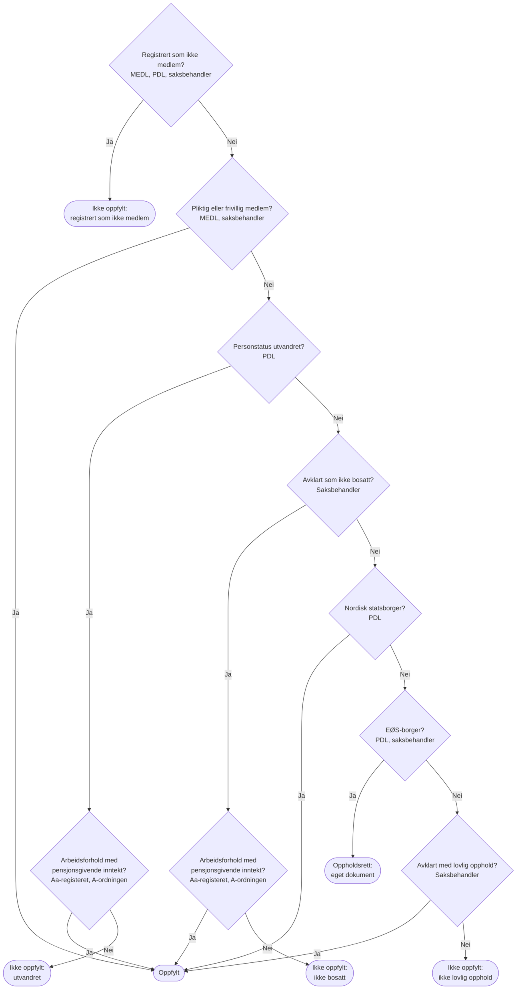

# Medlemskap etter nasjonale regler

Hvordan systemet lager et forslag til medlemskapsperioder fra
behandlingsgrunnlaget for medlemskap, for personer som ikke vurderes etter
EØS-reglene. Forslaget bygger på hvordan K9 og EF gjør det, og de er beskrevet
lenger ned. Begrepene er definert i [CONTEXT.md](../../CONTEXT.md), og
behandlingsgrunnlaget er beskrevet i
[behandlingsgrunnlag/medlemskap](../behandlingsgrunnlag/medlemskap/medlemskap.md).

Dette dokumentet er et forslag til hvordan systemet kan foreslå
medlemskapsperioder, ikke en beslutning om at vi skal lage det. Første runde
kan bli at systemet bare henter og viser behandlingsgrunnlaget, og at
saksbehandler vurderer alt. Da kommer forslag til medlemskapsperioder senere, og kanskje først etter at vi henter fra Aa-registeret og A-ordningen.
Se [Ambisjonsnivå](../behandlingsgrunnlag/medlemskap/medlemskap.md#ambisjonsnivå).
Ingenting av dette er i produksjon. Delene om MEDL og rekkefølgen må vi jobbe
mer med.

## Funksjonen

Funksjonen tar inn behandlingsgrunnlaget fra MEDL og PDL og gir et forslag til
medlemskapsperioder for hele tidslinjen. Hvis vi henter fra Aa-registeret og
A-ordningen før forslaget lages, blir de også input. Funksjonen er ren: den
henter ikke noe, den lagrer ikke noe, og den vet ikke hvilken behandling den
gjelder. Den som kaller den, kutter tidslinjen til perioden som er aktuell.

```kotlin
fun foreslåMedlemskapsperioder(
    unntaksperioder: List<MedlUnntaksperiode>,
    personopplysninger: PdlPersonopplysninger,
): List<ForslagTilMedlemskapsperiode>

sealed interface ForslagTilMedlemskapsperiode {
    val fraOgMedDato: LocalDate?
    val tilOgMedDato: LocalDate?

    data class Foreslått(
        override val fraOgMedDato: LocalDate?,
        override val tilOgMedDato: LocalDate?,
        val vurdering: Vurdering,
        val regelverk: Regelverk,
        val begrunnelse: String,
    ) : ForslagTilMedlemskapsperiode

    data class MåVurderesManuelt(
        override val fraOgMedDato: LocalDate?,
        override val tilOgMedDato: LocalDate?,
        val grunner: Set<GrunnTilManuellVurdering>,
    ) : ForslagTilMedlemskapsperiode
}
```

- Periodene dekker hele tidslinjen uten hull og uten overlapp. `null` betyr
  åpen ende, som i vilkårstabellene.
- `Foreslått` har alltid `Regelverk.NASJONALE_REGLER` i denne omgang.
  `begrunnelse` sier hvilke opplysninger som ga forslaget, for eksempel
  «Bosatt i Norge og nordisk statsborger».
- `MåVurderesManuelt` har ingen vurdering. «Uavklart» er ikke en vurdering i
  domenet. En periode kan ha flere grunner samtidig.
- Like perioder ved siden av hverandre slås sammen.

Forslaget er at forslag til medlemskapsperioder ikke lagres, men beregnes når
saksbehandler ser på vilkåret. Saksbehandler godtar eller endrer det, og først da lagres
`VilkårMedlemskap`. Hentes grunnlaget på nytt etter at medlemskap er vurdert,
beholdes vurderingen. Avviker et nytt forslag fra det som er lagret, viser vi
at grunnlaget er endret.

## Fra opplysninger til tidslinjer

Hver opplysning blir en tidslinje for seg, og en ny periode begynner der én av
dem endrer seg. Det er samme idé som vurderingsdatoene i K9, men vi vurderer
hver periode i stedet for hver dato.

| Tidslinje | Kilde | Periode |
|---|---|---|
| Unntaksperioder | MEDL | `fraOgMed`–`tilOgMed` |
| Personstatus | PDL | Fra `gyldighetstidspunkt` til neste status begynner |
| Bostedsadresse | PDL | `gyldigFraOgMed`–`gyldigTilOgMed` |
| Statsborgerskap | PDL | `gyldigFraOgMed`–`gyldigTilOgMed`. Flere kan gjelde samtidig. |

Personstatus «død» avslutter tidslinjen. Perioder før den første
personstatusen får grunnen «mangler opplysninger».

## Tolkning av MEDL

Forslaget tar utgangspunkt i hvordan K9 tolker unntaksperiodene. Det er beskrevet i
[Hvordan K9 tolker dekningskodene](#hvordan-k9-tolker-dekningskodene). For hver
periode på tidslinjen:

| Unntaksperioder i perioden | Forslag |
|---|---|
| Status `GYLD`, dekning i gruppen «ikke medlem» | NEI |
| Status `GYLD`, dekning `Unntatt`, ikke statsborger i USA eller Papua Ny-Guinea | NEI |
| Status `GYLD`, dekning `Unntatt`, statsborger i USA eller Papua Ny-Guinea | Må vurderes manuelt |
| Status `GYLD`, dekning i gruppen «pliktig eller frivillig medlem» | JA |
| Status `UAVK`, dekning i gruppen «uavklart», kilde Lånekassen, lovvalg under avklaring eller åpen periode | Må vurderes manuelt |
| Dekning i gruppen «ukjent» eller en kode vi ikke kjenner | Må vurderes manuelt |
| Andre statuser (for eksempel avvist) | Tas ikke med |
| Ingen unntaksperioder | PDL avgjør |

Gjelder flere unntaksperioder samtidig, sjekkes «ikke medlem» før «pliktig
eller frivillig medlem», som i K9.

Forslaget avviker fra K9 på ett punkt: ukjente dekningskoder blir manuell
vurdering. K9 tar dem ikke med, og da forsvinner de uten varsel.

**Spørsmål til fag: passer K9 sine grupper for § 2-9?** K9 regner
`FTL_2-9_1_ledd_a` og `_c` som medlem og `FTL_2-9_1_ledd_b` som ikke medlem.
§ 2-9 første ledd lister opp hvilke kapitler hver bokstav dekker, og kap. 6
står ikke under samme bokstaver som kap. 9 og kap. 14. Grupperingen kan komme
fra foreldrepenger (regeltreet heter `FP_VK_2`). Fag må vurdere
hvilke av § 2-9-kodene som gir medlemskap for grunnstønad.

### Mulig forenkling

K9 sine grupper er laget for K9 sine ytelser. En enklere regel, nærmere EF:

- Bare status `GYLD` teller. `UAVK` gir manuell vurdering.
- `medlem = false` gir NEI.
- `medlem = true` gir JA bare når dekningskoden står på en liste over koder
  som dekker kap. 6. Ellers manuell vurdering, fordi frivillig medlemskap
  etter § 2-9 kan dekke bare deler av folketrygden.

Listen over koder som dekker kap. 6, må fag lage. Inntil den finnes,
gir alle perioder med `medlem = true` manuell vurdering.

## Tolkning av PDL

Gjelder perioder der MEDL ikke avgjør. Følger K9-regeltreet:

1. **Bosatt?** Personstatus må være bosatt, og bostedsadressen kan ikke være
   utenlandsk. Ellers manuell vurdering: saksbehandler vurderer om søker er
   bosatt, eller medlem etter § 2-2. Det gjelder også D-nummer, som K9 regner
   som bosatt i regeltreet, men lager aksjonspunkt for.
2. **Statsborgerskap.** Har søker flere statsborgerskap samtidig, gjelder
   regionen med høyest rang: Norden over EØS, EØS over tredjeland.
   - Nordisk statsborger → JA.
   - EØS-borger → manuell vurdering av oppholdsrett (EØS, eget dokument
     senere).
   - Tredjelandsborger → manuell vurdering av lovlig opphold. `opphold` fra
     PDL vises for saksbehandler. Senere kan den kanskje gi forslag om JA.

K9 er ikke konsekvent her. Vurderingsdatoene bruker regionen med høyest rang,
men regeltreet (`VurderLøpendeMedlemskap`) og aksjonspunktene
(`AvklaringFaktaMedlemskap`) bruker bare det første statsborgerskapet i
listen fra PDL. Listen er ikke sortert på region. En søker med statsborgerskap
i både USA og Sverige kan derfor få aksjonspunkt for lovlig opphold hvis USA
står først, selv om det svenske statsborgerskapet skulle gitt oppfylt vilkår.
Forslaget i dette dokumentet er å alltid bruke regionen med høyest rang.

## Rekkefølge mellom MEDL og PDL

**Til diskusjon.** K9 sin regel er at MEDL vinner: en gyldig unntaksperiode
som ikke medlem gir NEI selv om søker er bosatt, og en gyldig periode som
pliktig eller frivillig medlem gir JA selv om søker er utvandret. PDL brukes
bare der MEDL ikke avgjør. Forslaget følger K9 inntil vi har diskutert det.

Spørsmål å diskutere:

- Er det riktig at MEDL alltid vinner, også når MEDL og PDL er uenige om
  søker bor i Norge?
- Skal uenighet mellom kildene heller gi manuell vurdering?

## Grunner til manuell vurdering

| Grunn | Når | Tilsvarer i K9 |
|---|---|---|
| `MANGLER_OPPLYSNINGER` | Ingen personstatus i perioden | – |
| `MEDL_MÅ_AVKLARES` | Status `UAVK`, uavklart dekning, Lånekassen, lovvalg under avklaring eller åpen periode | Avklar gyldig medlemskapsperiode |
| `MEDL_UKJENT_DEKNING` | Dekning i gruppen «ukjent» eller ny kode | – (K9 tar dem ikke med) |
| `UNNTATT_STATSBORGER_USA_ELLER_PAPUA_NY_GUINEA` | Unntatt i MEDL og statsborger i USA eller Papua Ny-Guinea | Avklar lovlig opphold |
| `VURDER_BOSATT` | Personstatus er ikke bosatt, eller utenlandsk bostedsadresse | Avklar om søker er bosatt |
| `EØS_OPPHOLDSRETT` | Bosatt, og høyeste region er EØS | EØS-grenen i regeltreet |
| `VURDER_LOVLIG_OPPHOLD` | Bosatt tredjelandsborger | Avklar lovlig opphold |

## Kilder og regler som ikke er med

Dette må vi se nærmere på. Arbeid og inntekt kan bli med før vi lager
forslaget.

- **Arbeid i Norge (ftrl. § 2-2).** Kan gi medlemskap for en som ikke er
  bosatt. K9 bruker arbeidsforhold og pensjonsgivende inntekt fra
  Aa-registeret og A-ordningen. Uten dem får slike perioder `VURDER_BOSATT`.
- **EØS.** Oppholdsrett for EØS-borgere krever også arbeid og inntekt, og får
  et eget dokument. Til da får EØS-borgere `EØS_OPPHOLDSRETT`.
- **Utenlandsopphold fra søknaden.** K9 og EF bruker det. Vi vet ikke om
  søknaden om grunnstønad spør om det.

## Slik gjør EF

familie-ef-sak har to vilkår: forutgående medlemskap og opphold i Norge.
Opphold i Norge ligner mest på vårt vilkår. Behandlingsgrunnlaget er beskrevet
i [behandlingsgrunnlag/medlemskap](../behandlingsgrunnlag/medlemskap/medlemskap.md#slik-gjør-ef).

- Vilkåret vurderes for hele behandlingen, ikke per periode.
- Systemet vurderer bare de klare tilfellene, og bare som «ja»: norsk
  statsborger, bosatt, og søknaden sier at søker bor og oppholder seg i Norge.
- MEDL brukes ikke automatisk. Gyldige unntaksperioder vises for
  saksbehandler.
- Alt annet vurderer saksbehandler med faste svaralternativer.

Forslaget tar med seg at systemet bare foreslår det som er klart, og at resten
vurderes av saksbehandler. Den tar ikke med at vilkåret vurderes for hele
behandlingen.

## Slik gjør K9

K9 kaller unntaksperiodene for medlemskap fra MEDL for «medlemskapsperioder». Her bruker vi
våre egne begreper.

Kildene er k9-sak på commit
[`2e6390a`](https://github.com/navikt/k9-sak/tree/2e6390aa03a6e7d6e18106975e9e756372c89249):

- `domenetjenester/medlem`: henter og tolker unntaksperioder for medlemskap, og finner ut
  hva saksbehandler må avklare (`VurderMedlemskapTjeneste` og `Avklar*`).
- `domenetjenester/inngangsvilkar/.../medlemskap`: regeltreet
  (`Medlemskapsvilkår`, `FP_VK_2`) og grunnlaget for det
  (`VurderLøpendeMedlemskap`).

### Behandlingsgrunnlaget K9 bruker

| Opplysning | Kilde | Hvordan K9 bruker den |
|---|---|---|
| Unntaksperioder for medlemskap med status gyldig eller uavklart | MEDL | Dekningskoden oversettes til K9 sin egen type |
| Personstatus | PDL | Bosatt, utvandret, død eller annet |
| Statsborgerskap | PDL | Oversettes til region: Norden, EØS eller tredjeland |
| Adresser | PDL | Utenlandsk adresse gir behov for avklaring |
| Utenlandsopphold | Søknaden | Oppgitt opphold i utlandet gir behov for avklaring |
| Arbeidsforhold og pensjonsgivende inntekt | Aa-registeret og A-ordningen | Kan gi oppfylt vilkår for den som ikke er bosatt |

K9 ber bare MEDL om unntaksperioder for medlemskap med status `GYLD` og `UAVK` (`MedlemsunntakRestKlient` i k9-felles).

### Vurderingsdatoer

K9 vurderer ikke en sammenhengende tidslinje. Vilkåret vurderes på bestemte
datoer, og hver vurdering gjelder fram til neste dato.
`UtledVurderingsdatoerForMedlemskapTjeneste` finner datoene:

- Første dag i hver periode som vurderes.
- Datoer der personstatusen endres. Endringer til og fra død teller ikke.
- Datoer der adressetypen endres, for eksempel fra norsk til utenlandsk
  adresse.
- Datoer der regionen for statsborgerskapet endres. Har søker flere
  statsborgerskap samtidig, gjelder regionen med høyest rang, der Norden
  rangeres over EØS og EØS over tredjeland.
- Datoer der unntaksperiodene for medlemskap i MEDL er endret siden første henting i
  behandlingen.

### Hvordan K9 tolker dekningskodene

K9 oversetter dekningskoden fra MEDL til `MedlemskapDekningType` og deler
typene i grupper (`MedlemskapsperiodeKoder` og `MedlemskapDekningType`):

| Gruppe | Dekningskoder fra MEDL | Betyr |
|---|---|---|
| Pliktig eller frivillig medlem | `FTL_2-7_*`, `FTL_2-9_1_ledd_a`, `FTL_2-9_a`, `FTL_2-9_1_ledd_c`, `FTL_2-9_c`, `FTL_2-9_2_ld_jfr_1a`, `FTL_2-9_2_ld_jfr_1c`, `Full` | Oppfylt |
| Ikke medlem | `FTL_2-6`, `FTL_2-9_1_ledd_b`, `FTL_2-9_b` | Ikke oppfylt |
| Unntatt | `Unntatt` | Ikke oppfylt, med mindre søker er statsborger i USA eller Papua Ny-Guinea |
| Uavklart | `IHT_Avtale`, `IHT_Avtale_Forord`, `Opphor` | Saksbehandler må avklare |
| Ukjent | `FTL_2-9_2_ledd`, `IKKEPENDEL`, `PENDEL`, `IT_DUMMY`, `IT_DUMMY_EOS` | Blir ikke tatt med |

En unntaksperiode for medlemskap tas bare med når den har både fra- og til-dato og dekker
vurderingsdatoen. Unntaksperioder for medlemskap fra Lånekassen og med lovvalg «under
avklaring» tas heller ikke med. Unntaksperioder for medlemskap som er åpne i én ende,
kommer fra Lånekassen eller har lovvalg «under avklaring», må saksbehandler
avklare.

K9 bruker ikke feltet `medlem` fra MEDL i vurderingen. Det er dekningskoden
som avgjør.

### Regeltreet

Regeltreet `FP_VK_2` kjøres for hver vurderingsdato. Når saksbehandler ikke
har avklart noe, er standardsvaret at søker er bosatt og har lovlig opphold.
Hver node viser hvor K9 henter svaret fra.



- **Registrert som ikke medlem:** søker har en unntaksperiode for medlemskap i gruppen «ikke
  medlem», eller i gruppen «unntatt» uten å være statsborger i USA eller Papua
  Ny-Guinea. Saksbehandler kan også ha avklart at søker ikke er medlem.
- **Pliktig eller frivillig medlem:** søker har en unntaksperiode for medlemskap i gruppen
  «pliktig eller frivillig medlem», eller saksbehandler har avklart at søker er
  medlem.
- **Arbeidsforhold med pensjonsgivende inntekt:** søker har et arbeidsforhold
  som har startet og ikke er avsluttet på vurderingsdatoen, og har
  pensjonsgivende inntekt fra samme arbeidsgiver.
- **Personstatus:** personer med D-nummer regnes som bosatt i regeltreet.

### Når saksbehandler må avklare

K9 lager aksjonspunkter når opplysningene ikke er nok
(`VurderMedlemskapTjeneste`):

| Aksjonspunkt | Når |
|---|---|
| Avklar om søker er bosatt | Personstatusen er noe annet enn bosatt eller død, for eksempel D-nummer. Søker har oppgitt utenlandsopphold. Eller søker har utenlandsk adresse uten å være registrert som pliktig, frivillig eller ikke medlem i MEDL. |
| Avklar gyldig unntaksperiode for medlemskap | Søker har unntaksperioder for medlemskap, men ingen gyldig periode som pliktig eller frivillig medlem, og minst én periode er under avklaring, kommer fra Lånekassen, er åpen eller har en uavklart dekningskode. |
| Avklar lovlig opphold | Søker er tredjelandsborger, er ikke utvandret og har ingen gyldig unntaksperiode for medlemskap med kjent dekning. Eller søker er unntatt i MEDL, er statsborger i USA eller Papua Ny-Guinea og er ikke utvandret. |

Saksbehandler svarer per vurderingsdato. Svaret erstatter standardsvaret i
regeltreet.

K9 lager også en vurderingsdato der MEDL er endret siden første henting i
behandlingen. Det trenger vi trolig ikke hvis en ny henting erstatter
grunnlaget og forslaget beregnes på nytt.

## Åpne spørsmål

- Hvilke dekningskoder i MEDL dekker kap. 6? Det avgjør om vi kan bruke den
  mulige forenklingen.
- Hvorfor behandler K9 statsborgere i USA og Papua Ny-Guinea særskilt når de
  er unntatt i MEDL? Koden forklarer det ikke («Sært, men USA og Papua
  Ny-Guinea særbehandles»). Til fag har beskrevet regelen, blir de
  vurdert manuelt.
- Hvem regnes som nordiske statsborgere? Gjelder det Færøyene, Grønland og
  Åland også?
- Hva gjelder for statsløse og personer med ukjent statsborgerskap?
- Skal en åpen unntaksperiode i MEDL gi manuell vurdering, som i K9? Med
  tidslinjer kan en åpen periode tolkes som løpende.
- Hva gjør vi når PDL har overlappende bostedsadresser eller personstatuser?
- Skal MEDL vinne over PDL? Se [Rekkefølge mellom MEDL og
  PDL](#rekkefølge-mellom-medl-og-pdl).
