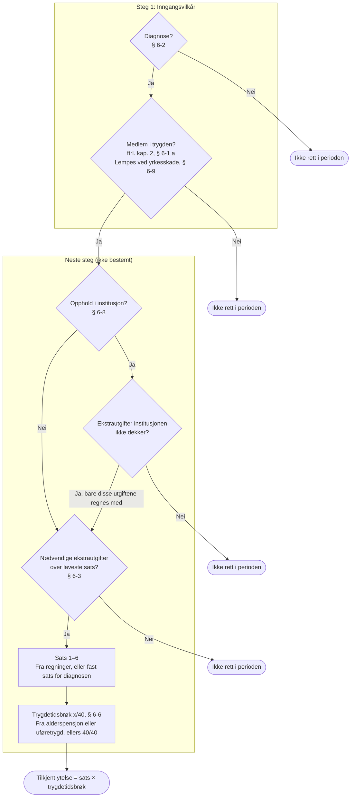

# Vilkår for grunnstønad

Oversikt over hvordan behandlingsgrunnlaget brukes til å vurdere vilkårene for
grunnstønad etter folketrygdloven kapittel 6, og hvordan vilkårene gir tilkjent
ytelse. Begrepene er definert i [CONTEXT.md](../../CONTEXT.md). Beslutningene
og de åpne spørsmålene står i
[ADR-0006](../adr/ADR-0006-fem-vilkaar-med-inngangsvilkaar-som-foerste-steg.md).

## Vurdering av én periode

Alle vilkår vurderes per periode. Diagrammet viser hvordan én periode ender med
tilkjent ytelse eller uten rett. Er det ingen perioder der inngangsvilkårene er
oppfylt, blir det avslag uten at de andre vilkårene vurderes.

## Behandlingsgrunnlag

Behandlingsgrunnlaget kommer med søknaden eller fra registre. Mangler noe, kan
saksbehandler be søker om ettersending eller innhente opplysninger direkte fra
lege, spesialist eller medisinsk ekspert.

| Vilkår | Behandlingsgrunnlag | Kilde |
|---|---|---|
| Medlemskap | Personopplysninger, unntaksperioder for medlemskap | PDL, MEDL |
| Diagnose | Legeerklæring, uttalelse fra medisinsk ekspert | Søknad, ettersending, innhenting |
| Institusjon | Institusjonsopphold | INST2 |
| Nødvendige ekstrautgifter | Regninger og kvitteringer, legeerklæring | Søknad, ettersending, innhenting |
| Trygdetid | Alderspensjon eller uføretrygd | Pesys |

## Vilkårene

| Vilkår | Hjemmel | Gruppe | Skjønn |
|---|---|---|---|
| Medlemskap | ftrl. kap. 2, jf. § 6-3 første ledd, og § 6-1 a | Inngangsvilkår | Nei |
| Diagnose | § 6-2, § 6-9 | Inngangsvilkår | Nei |
| Institusjon | § 6-8 | Vilkår | Ja |
| Nødvendige ekstrautgifter | § 6-3 | Vilkår | Ja |
| Trygdetid | § 6-6 | Vilkår | Nei |

- **Inngangsvilkårene** vurderes først. De andre vilkårene vurderes bare i
  perioder der både medlemskap og diagnose er oppfylt. Er det ingen slike
  perioder, blir det avslag uten flere vurderinger.
- **Medlemskap** vurderes etter reglene for medlemskap i folketrygden. Er
  diagnosen en yrkesskade, lempes medlemskapskravet etter § 6-9. Se
  [hvordan systemet foreslår medlemskapsperioder etter nasjonale regler](nasjonalt-medlemskap.md).
- **Diagnose** vurderes ut fra legeerklæringen.
- **Institusjon:** Søker som bor på institusjon, får ikke grunnstønad i
  perioden. Unntaket er når søker har ekstrautgifter ut over det institusjonen
  dekker. Da regnes bare disse utgiftene med.
- **Nødvendige ekstrautgifter** vurderes ut fra regninger søker legger ved,
  eller direkte ut fra diagnosen. Noen diagnoser, for eksempel cøliaki, gir en
  fast sats. Ekstrautgifter under laveste sats gir ikke rett.
- **Trygdetid** hentes fra alderspensjonen eller uføretrygden og kan ikke
  skjønnsvurderes. Har søker ingen av dem, er brøken 40/40.

## Periodisering

Alt periodiseres: behandlingsgrunnlaget, hvert vilkår og tilkjent ytelse.
Tilkjent ytelse er tidslinjen av sats × trygdetidsbrøk i periodene der søker
har rett. Satsen og trygdetidsbrøken kan endre seg underveis, for eksempel når
søker får alderspensjon eller får nye ekstrautgifter.

## Åpne spørsmål

Se [ADR-0006](../adr/ADR-0006-fem-vilkaar-med-inngangsvilkaar-som-foerste-steg.md#åpne-spørsmål).
